<h1>User Manual</h1>


<h2 id="toc">Table Of Contents</h2>

- [Introduction](#introduction)
  - [Features](#introduction-features)
- [Concepts](#concepts)
  - [Project](#concepts-project)
  - [Track](#concepts-track)
  - [Note Track](#concepts-note-track)
  - [Curve Track](#concepts-curve-track)
  - [MIDI/CV Track](#concepts-midi-cv-track)
  - [Pattern](#concepts-pattern)
  - [Song](#concepts-song)
  - [Scale](#concepts-scale)
  - [Clock](#concepts-clock)
  - [Routing](#concepts-routing)
  - [Controller](#concepts-controller)
- [User Interface](#ui)
  - [Overview](#ui-overview)
  - [Navigation](#ui-navigation)
  - [Page Layout](#ui-page-layout)
  - [List Pages](#ui-list-pages)
  - [Copy/Paste](#ui-copy-paste)
- [Pages](#pages)
  - [Project](#pages-project)
  - [Layout](#pages-layout)
  - [Track](#pages-track)
  - [Sequence](#pages-sequence)
  - [Sequence Edit](#pages-sequence-edit)
  - [Song](#pages-song)
  - [Tempo](#pages-tempo)
  - [Pattern](#pages-pattern)
  - [Performer](#pages-performer)
  - [Routing](#pages-routing)
  - [User Scale](#pages-user-scale)
  - [Monitor](#pages-monitor)
  - [Clock](#pages-clock)
  - [Settings](#pages-settings)
- [Controllers](#controllers)
  - [Launchpad](#controllers-launchpad)

<h2 id="introduction">Introduction</h2>

**per|former** is an open source and open hardware eurorack sequencer module. It packs a lot of functionality into a small form factor and was designed both as a versatile sequencer in the studio as well as for live performance.

<h3 id="introduction-features">Features</h3>

- 8 track sequencer
- 16 patterns per project
- 64 steps per sequence
- Multiple track and sequence modes
- Note and modulation sequencing
- Snapshot system
- Sequence generators
- Advanced clock system
- 8 CV Outputs (-5V to 5V)
- 8 Gate Outputs (5V)
- 4 CV Inputs (-5V to 5V)
- Clock input/output
- MIDI input/output
- USB host port with support for USB MIDI controllers
- 256x64 pixel OLED display
- Encoder with push button
- 32 buttons with bi-color leds
- 5 function buttons with labels on display
- MicroSD card slot

<h2 id="concepts">Concepts</h2>

This chapter introduces the basic concepts of the **per|former** sequencer and should familiarize readers with the overall functionality of the sequencer. More in-depth information about specific features are provided in the following chapters.

<h3 id="concepts-project">Project</h3>

A project stores the complete state of the sequencer, with the exception of calibration data. Only one project can be loaded at any given time and all data is volatile, meaning that all changes are lost when the unit is powered off. To persist a project it needs to be stored to the SDCard (see [Project](#pages-project) page).

The following shows a high level diagram of the data contained in a project:

```
┌─────────────────────────────────────────────────────┐
│                       Project                       │
├──────────────────────────┬──────────────────────────┤
│         Settings         │                          │
│          Layout          │                          │
│           Song           │        Tracks 1-8        │
│        Play State        │                          │
│         Routing          │                          │
└──────────────────────────┴──────────────────────────┘
             ┌───────────────────────────┘
             ▼
┌────────────────────────┐   ┌────────────────────────┐
│         Track          │ ┌▶│        Sequence        │
├────────────────────────┤ │ ├────────────────────────┤
│        Settings        │ │ │        Settings        │
├────────────────────────┤ │ ├────────────────────────┤
│     Sequences 1-16     │─┘ │       Steps 1-64       │
└────────────────────────┘   └────────────────────────┘
```

The project is split into two blocks, a global block of data and a block of data for each of the 8 tracks. Each track contains a block of settings and 16 sequences. Each sequence in turn contains a block of settings and its 64 steps.

The 16 sequences of the 8 tracks are collectively handled as patterns.

> Note: Calibration data is stored in the flash memory of the microcontroller and can be backed up and restored from the SDCard. This allows for changing the SDCard or run the sequencer without an SDCard at all and still have it properly calibrated.

<h3 id="concepts-track">Track</h3>

Each of the 8 available tracks is independent of every other track. This means that every sequence of a track can have a different time division, run mode, duration or scale among other things.

<h4>Track Mode</h4>

Each track can be configured to a specific mode. The following modes are available:

- Note
- Curve
- MIDI/CV

In note mode, the default mode, a track offers advanced step sequencing for programming rhythms and melodies. Curve mode also uses step sequencing, but each step is defined as a curve shape, making this mode very versatile for generating modulation signals. In MIDI/CV mode, a track acts as a MIDI to CV converter, which can be useful when attaching a MIDI keyboard to play some voices live or sequence them from an external MIDI sequencer.

<h4>Track Routing</h4>

In the default configuration, each track controls one of the CV/gate output pairs of the sequencer to control a single voice. However, this configuration can be changed to allow for more flexible routing of the virtual track outputs to the physical CV/gate outputs. For example, a MIDI/CV track can feed more than one physical CV/gate output to allow polyphonic operation or output a velocity signal in addition to the pitch signal.

<h4>Track Linking</h4>

In note or curve mode, a track generates a single CV signal, typically a pitch or modulation signal. To control a voice with multiple signals, for example a pitch and velocity signal, two tracks can be linked together. The first track is used to generate the pitch signal while the second track generates the velocity signal. To make both sequences run in lock-step, the second track can be linked to the first track, essentially doubling the playback behaviour of the first track.

Track modes, the physical routing to CV/gate outputs and track linking can be configured on the [Layout](#pages-layout) page.

<h3 id="concepts-note-track">Note Track</h3>

In note mode, which is set by default, a track uses step sequencing to output gate and CV signals. A sequence consists of a maximum 64 steps, with each step offering a

TODO

<h3 id="concepts-curve-track">Curve Track</h3>

TODO

<h3 id="concepts-midi-cv-track">MIDI/CV Track</h3>

In MIDI/CV mode, a track acts as a MIDI to CV converter, taking MIDI note data from either the MIDI or USBMIDI input and feeding it to the CV/gate outputs. This allows for playing voices live from a keyboard or use an external MIDI sequencer to control them. In addition this mode allows the module to act as a very flexible MIDI to CV converter.

<h3 id="concepts-pattern">Pattern</h3>

There is a total of 16 patterns per project. Each pattern stores the sequences of all 8 tracks.

TODO

<h3 id="concepts-snapshot">Snapshot</h3>

In addition to the 16 patterns per project, there is an additional snapshot pattern which can temporarily be used to change sequences without affecting the original sequences. Snapshots come in handy during live performance to quickly allow changing sequences and then going back to the original state or commiting the changes either to the original sequences or to a new pattern. Snapshots are controlled from the [Pattern](#pages-pattern) page.

<h3 id="concepts-song">Song</h3>

Songs are used to chain together a sequence of patterns. This can either be used to quickly chain together a few patterns during a live performance to get more variation or to create an entire arrangement of a song.

A song consists of up to 16 slots, each holding a set of sequences to be played on the 8 tracks in addition to specifying how many times the slot is repeated when played back. Songs are controlled from the [Song](#pages-song) page.

<h3 id="concepts-scale">Scale</h3>

In contrast to many other sequencers that directly operate on chromatic note values, the **per|former** sequencer is using the concept of voltage tables. Each note is stored as an index into a voltage table that do not necessarily have a specific musical meaning. While offering many of the more commonly used scales in form of presets, the sequencer also provides some scales beyond the typical western chromatic variants, for example a 24 tone equal temperament scale. The additional 4 user scales allow for even more experimentation as well as setting up voltage tables to specifically address discrete values of a CV input on another module. This allows for example to select a specific sample slot, choose a wavetable or similar applications.

A global default scale and root note can be specified on the [Project](#pages-project) page which can be overriden for individual sequences in the [Sequence](#pages-sequence) page. The user scales can be edited on the [User Scale](#pages-user-scale) page.

<h3 id="concepts-clock">Clock</h3>

The sequencer is driven by a flexible clock system. In master mode, the clock is generated internally and can be sent to external gear and modules using MIDI clock and analog clock signals. In slave mode, the clock is received from an external source via MIDI or analog clock sigals. For convenience, the clock is by default set to an auto mode that automatically switches to master mode when the sequencer is started manually or switches to the slave mode when an external clock signal is detected.

To allow accurate and tight timing, the internal clock resolution is 192 parts per quarter note (PPQN). In master mode, a hardware timer is used to generate an accurate, low-jitter clock signal. To drive external clock sigals, the internal clock is divided down to the required PPQN of the external clock signals. In slave mode, the external clock signal is multiplied internally to generate the 192 PPQN internal clock resolution, which in turn is used to clock the sequencer as well as the external clock signals.

TODO

<h3 id="concepts-routing">Routing</h3>

TODO

<h3 id="concepts-controller">Controller</h3>

TODO

<h2 id="ui">User Interface</h2>

<h3 id="ui-overview">Overview</h3>

The user interface of the **per|former** sequencer is made up from the following components:

- OLED display
- Rotary encoder with button
- 5 function button
- 32 button with bi-color LEDs

The rotary encoder will furthermore be denoted as `ENCODER`. The buttons are split into 4 groups:

<h4>Function Buttons</h4>

There are 5 function buttons below the display: `F1`, `F2`, `F3`, `F4` and `F5`. The function associated with each button depends on the currently selected page and context. However, due to each function button being dynamically labeled on the display, its always easy to see what the associated functions are.

<h4>Global Buttons</h4>

There are 8 global buttons: `PLAY`, `TEMPO`, `PATT`, `PERF`, `PREV`, `NEXT`, `SHIFT` and `PAGE`.

| Button | Behaviour |
| :--- | :--- |
| `PLAY` | Starts/stops the master clock. |
| `SHIFT` + `PLAY` | Pause/continue or restart master clock depending on the configured _Shift Mode_ on the [Clock](#pages-clock) page. |
| `TEMPO` | Temporarily show the [Tempo](#pages-tempo) page. |
| `PAGE` + `TEMPO` | Enter the [Clock](#pages-clock) page. |
| `PATT` | Temporarily show the [Pattern](#pages-pattern) page. |
| `PAGE` + `PATT` | Enter the [Pattern](#pages-pattern) page. |
| `PERF` | Temporarily show the [Performer](#pages-performer) page. |
| `PAGE` + `PERF` | Enter the [Performer](#pages-performer) page. |
| `PREV`, `NEXT` | Depends on current context. |
| `SHIFT` | Enable alternate function, depends on current context. |
| `PAGE` | Switch between pages. |
| `SHIFT` + `PAGE` | Open context menu on the active page. |

<h4>Track Buttons</h4>

There are 8 track buttons: `TRACK1` up to `TRACK8`. These buttons are generally used to selected the active track, but also to select pages in combination with the `PAGE` key and some other functions depending on the active page.

<h4>Step Buttons</h4>

There are 16 step buttons: `STEP1` up to `STEP16`. These buttons are generally used to select steps in a sequence, but also to select pages in combination with the `PAGE` key and some other functions depending on the active page.

<h3 id="ui-navigation">Navigation</h3>

The user interface is organized in multiple pages, each page giving access to a different part of the sequencer such as:

- editing configuration options
- editing sequences and steps
- performance related functions such as tempo, muting or pattern selection
- displaying various other information

The active page is selected by holding the `PAGE` button and pressing the corresponding page button:

| Button | Page |
| :--- | :--- |
| `PAGE` + `CLOCK` (`TEMPO`) | [Clock](#pages-clock) |
| `PAGE` + `PATT` | [Pattern](#pages-pattern) |
| `PAGE` + `PERF` | [Performer](#pages-performer) |
| `PAGE` + `PROJECT` (`TRACK1`) | [Project](#pages-project) |
| `PAGE` + `LAYOUT` (`TRACK2`) | [Layout](#pages-layout) |
| `PAGE` + `TRACK` (`TRACK3`) | [Track](#pages-track) |
| `PAGE` + `SEQ` (`TRACK4`) | [Sequence](#pages-sequence) |
| `PAGE` + `SEQ EDIT` (`TRACK5`) | [Sequence Edit](#pages-sequence-edit) |
| `PAGE` + `SONG` (`TRACK7`) | [Song](#pages-song) |
| `PAGE` + `ROUTING` (`TRACK8`) | [Routing](#pages-routing) |
| `PAGE` + `USER SCALE` (`STEP1`) | [User Scale](#pages-user-scale) |
| `PAGE` + `MONITOR` (`STEP7`) | [Monitor](#pages-monitor) |
| `PAGE` + `SETTINGS` (`STEP8`) | [Settings](#pages-settings) |

There are 3 special pages which can be entered temporarily by just holding a single button, namely the [Tempo](#pages-tempo), [Pattern](#pages-pattern) and [Performer](#pages-performer) pages. These pages give access to performance related features which need to be quickly accessible.

> Note: While holding `PAGE`, the leds are used to indicate the currently selected page as well as marking the buttons associated with a page.

<h3 id="ui-page-layout">Page Layout</h3>

Each page is divided into three sections.

<h4>Header</h4>

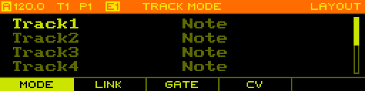

The _header_ is used to display the global state of the sequencer as well as information about the active page and context.

The current clock mode and tempo are shown in the top-left corner. The clock mode can by any of the following:

- `A` auto
- `M` master
- `S` slave
- `R` recording

The currently selected track is shown as `T1` - `T8`. The currently playing pattern on the selected track is shown as `P1` - `P16`. If a song is currently playing, the playing pattern is highlighted. The currently edited pattern is shown as `E1` - `E16` and is highlighted if it matches the pattern currently playing. If a snapshot is currently active, the pattern info is replaced with a single item `SNAP`.

The currently active page is shown in the top-right corner and optionally a sub-page or mode is shown to its left.

<h4>Body</h4>

The _body_ is used to display the main content for the active page.

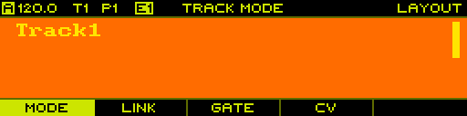

<h4>Footer</h4>

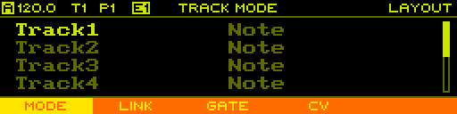

The _footer_ is used to display the labels of the function keys for the current page. On pages that provide a context menu, the labels dynamically change to the context menu actions when `SHIFT` + `PAGE` is hold.

<h3 id="ui-list-pages">List Pages</h3>

Pages that expose configuration options are typically presented as a list of name/value pairs.

TODO

<h3 id="ui-copy-paste">Copy/Paste</h3>

To allow moving and copying data, a copy/paste system is implemented that allows acting on the following objects:

- Track (see [Track](#pages-track) page)
- Sequence (see [Sequence](#pages-sequence) page)
- Steps (see [Sequence Edit](#pages-sequence-edit) page)
- Pattern (see [Pattern](#pages-pattern) page)
- User Scale (see [User Scale](#pages-user-scale) page)

> Note: Due to memory limitations, the clipboard can only hold one object at a time. This means that copying an object always results in the previously copied object beeing cleared from the clipboard.

<h2 id="pages">Pages</h2>

<h3 id="pages-project">Project</h3>

The _PROJECT_ page is entered using `PAGE` + `PROJECT`.

TODO

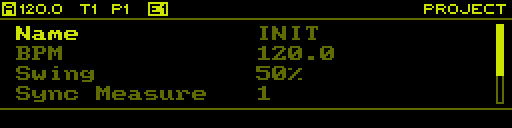

<h3 id="pages-layout">Layout</h3>

The _LAYOUT_ page is entered using `PAGE` + `LAYOUT`.

<h4>Track Mode</h4>

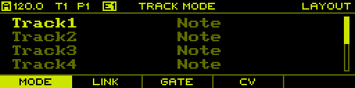

<h4>Link Track</h4>

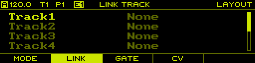

<h4>Gate Output</h4>

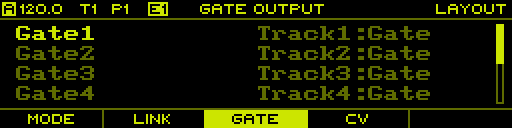

<h4>CV Output</h4>


<h3 id="pages-track">Track</h3>

The _TRACK_ page is entered using `PAGE` + `TRACK`.

TODO

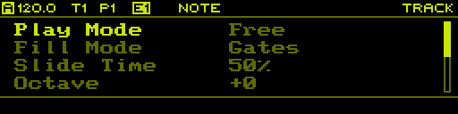

<h3 id="pages-sequence">Sequence</h3>

The _SEQUENCE_ page is entered using `PAGE` + `SEQ`.

TODO

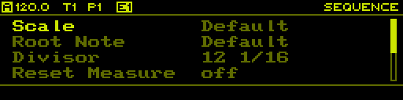

<h3 id="pages-sequence-edit">Sequence Edit</h3>

The _SEQUENCE EDIT_ page is entered using `PAGE` + `SEQ EDIT`.

TODO

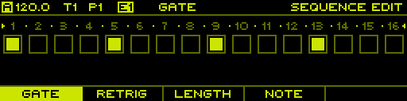

<h3 id="pages-song">Song</h3>

The _SONG_ page is entered using `PAGE` + `SONG`.

TODO

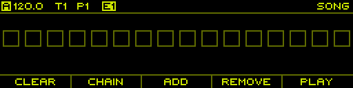

<h3 id="pages-tempo">Tempo</h3>

The _TEMPO_ page is temporarily shown while holding the `TEMPO`. On this page the tempo of the master clock is adjusted. Simply rotate the `ENCODER` to adjust the tempo. Hold and rotate the `ENCODER` to adjust the tempo in smaller steps. Hold `SHIFT` and rotate the `ENCODER` to adjust in larger steps.

<h4>Tap Tempo</h4>

In addition to manually adjusting the tempo, it can also be set using _tap tempo_ by pressing `PLAY` in a regular interval while holding `TEMPO`.

<h4>Nudging</h4>

To sync the master clock _by ear_ to some other source, for example a turntable, tempo nudging is a useful feature. This allows the tempo to be temporarily increased/decreased within a 10% range. Nudging is activated by olding `TEMPO` and holding `NEXT` or `PREV` to increase/decrease the tempo.

> Note: The tempo is incrementally increased/decreased up to 10%, so one needs to hold both `TEMPO` and `NEXT` or `PREV` for a small amount of time to get an effect.

<h3 id="pages-pattern">Pattern</h3>

**TODO:** insert image

The _PATTERN_ page can either be permanently entered using `PAGE` + `PATT` or just temporarily while holding `PATT`.

On this page you can handle pattern changes as well as selecting the currently edited pattern.

<h3 id="pages-performer">Performer</h3>

**TODO:** insert image

The _PERFORMER_ page can either be permanently entered using `PAGE` + `PERF` or just temporarily while holding `PERF`.

On this page you can handle mutes/solos as well as fills. Similar as with pattern changes you can also schedule mute, unmute or solo actions either by using _latching_ or _syncing_.

The temporary mode is very handy to quickly trigger performance actions while working on another page.

<h4>Mutes/Solos</h4>

Press `TRACK[1-8]` to mute and unmute tracks or `STEP[1-8]` to solo a track. Press `F3` to unmute all tracks at once.

<h4>Latching Mutes/Solos</h4>

To perform multiple actions at the same time, hold `F1` while executing mute, unmute or solo actions. All actions are scheduled and executed at the same time when `F1` is let go. While `F1` is hold and some actions have been scheduled, you can press `F5` to cancel them.

<h4>Synced Mutes/Solos</h4>

To execute actions on a musical beat, hold `F2` while executing mute, unmute or solo actions. A progress bar will appear at the top of the page, indicating the time until the actions are executed. Again, while holding `F2` you can press `F5` to cancel any scheduled action.

> Note: Synced actions are triggered on the beginning of a musical measure, configured on the [Project](#pages-project) page using the _SYNC MEASURE_ parameter.

<h4>Fills</h4>

Hold `STEP[9-16]` to enable fills on individual tracks. Hold `F4` to fill all tracks at once.

> Note: There are different fill modes that can be configured per track on the [Track](#pages-track) page using the _FILL MODE_ parameter.

<h3 id="pages-routing">Routing</h3>

The _ROUTING_ page is entered using `PAGE` + `ROUTING`.

TODO

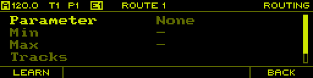


<h3 id="pages-user-scale">User Scale</h3>

The _USER SCALE_ page is entered using `PAGE` + `USER SCALE`. Here you can edit the 4 user scales stored in the project.

TODO

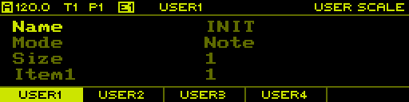

<h3 id="pages-monitor">Monitor</h3>

The _MONITOR_ page is entered using `PAGE` + `MONITOR`.

The first tab (`F1`) shows the current voltages of the CV inputs:

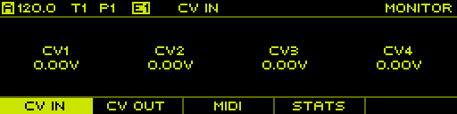

The second tab (`F2`) shows the current voltages of the CV outputs:

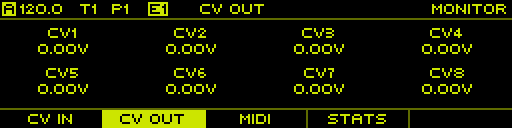

The third tab (`F3`) shows incoming MIDI messages:

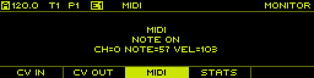

The fourth tab (`F4`) shows some general stats of the sequencer such as the total uptime and overflows of the MIDI message queues:

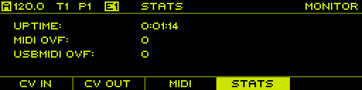

<h3 id="pages-clock">Clock</h3>

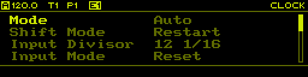

The _CLOCK_ page is entered using `PAGE` + `CLOCK` and is used to setup the clock system of the sequencer.

| Value  | Range | Description |
| :--- | :--- | :--- |
| Mode | Auto, Master, Slave | Clock mode |
| Shift Mode | Restart, Pause |  |
| Input Divisor | - | - |
| Input Mode | Reset, Run, Start/Stop | - |
| Output Divisor | - | - |
| Output Pulse | 1-5 ms | - |
| Output Mode | Reset, Run | - |
| MIDI RX | yes, no | Receive MIDI clock from MIDI port |
| MIDI TX | yes, no | Send MIDI clock to MIDI port |
| USBMIDI RX | yes, no | Receive MIDI clock from USBMIDI |
| USBMIDI TX | yes, no | Send MIDI clock to USBMIDI |

<h3 id="pages-settings">Settings</h2>

TODO

<h2 id="controllers">Controllers</h2>

<h3 id="controllers-launchpad">Launchpad</h3>

TODO
