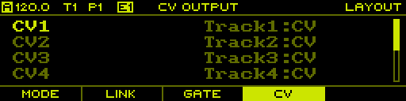

# User Manual


## Table Of Contents

- [Introduction](#introduction)
  - [Features](#features)
- [Concepts](#operation)
  - [Project](#project)
  - [Track](#track)
  - [Note Track](#note-track)
  - [Curve Track](#curve-track)
  - [MIDI/CV Track](#midi/cv-track)
  - [Pattern](#pattern)
  - [Song](#song)
  - [Scale](#scale)
  - [Clock](#clock)
  - [Routing](#routing)
  - [Controller](#controller)
- [User Interface](#user-interface)
  - [Overview](#overview)
  - [Navigation](#navigation)
  - [Page Layout](#page-layout)
  - [List Pages](#list-pages)
  - [Copy/Paste](#copy/paste)
- [Pages](#pages)
  - [Project Page](#project-page)
  - [Layout Page](#layout-page)
  - [Track Page](#track-page)
  - [Sequence Page](#sequence-page)
  - [Sequence Edit Page](#sequence-edit-page)
  - [Song Page](#song-page)
  - [Tempo Page](#tempo-page)
  - [Pattern Page](#pattern-page)
  - [Performer Page](#performer-page)
  - [Routing Page](#routing-page)
  - [User Scale Page](#user-scale-page)
  - [Monitor Page](#monitor-page)
  - [Clock Page](#clock-page)
- [Controllers](#controllers)
  - [Launchpad](#launchpad)


## Introduction

**per|former** is an open source and open hardware eurorack sequencer module. It packs a lot of functionality into a small form factor and was designed both as a versatile sequencer in the studio as well as for live performance.

### Features

- 8 track sequencer
- 16 patterns per project
- 64 steps per sequence
- Multiple track and sequence modes
- Note and modulation sequencing
- Snapshot system
- Sequence generators
- Advanced clock system
- 8 CV Outputs
- 8 Gate Outputs
- 4 CV Inputs (12bit internal ADC)
- Clock input/output
- MIDI input/output
- USB host port with support for USB MIDI controllers
- 256x64 pixel OLED display
- Encoder with push button
- Button/Led matrix (bi-color leds)
- MicroSD card slot

## Concepts

This chapter introduces the basic concepts of the **per|former** sequencer and should familiarize readers with the overall functionality of the sequencer. More in-depth information about specific features are provided in the following chapters.

### Project

A project stores the complete state of the sequencer, with the exception of calibration data. Only one project can be loaded at any given time and all data is volatile, meaning that all changes are lost when the unit is powered off. To persist a project it needs to be stored to the SDCard (see [project page](#project-page)).

The following shows a high level diagram of the data contained in a project:

```
┌─────────────────────────────────────────────────────┐
│                       Project                       │
├──────────────────────────┬──────────────────────────┤
│         Settings         │                          │
│          Layout          │                          │
│           Song           │        Tracks 1-8        │
│        Play State        │                          │
│         Routing          │                          │
└──────────────────────────┴──────────────────────────┘
             ┌───────────────────────────┘
             ▼
┌────────────────────────┐   ┌────────────────────────┐
│         Track          │ ┌▶│        Sequence        │
├────────────────────────┤ │ ├────────────────────────┤
│        Settings        │ │ │        Settings        │
├────────────────────────┤ │ ├────────────────────────┤
│     Sequences 1-16     │─┘ │       Steps 1-64       │
└────────────────────────┘   └────────────────────────┘
```

The project is split into two blocks, a global block of data and a block of data for each of the 8 tracks. Each track contains a block of settings and 16 sequences. Each sequence in turn contains a block of settings and its 64 steps.

The 16 sequences of the 8 tracks are collectively handled as patterns.

> Note: Calibration data is stored in the flash memory of the microcontroller and can be backed up and restored from the SDCard. This allows for changing the SDCard or run the sequencer without an SDCard at all and still have it properly calibrated.

### Track

Each of the 8 available tracks is independent of every other track. This means that every sequence of a track can have a different time division, run mode, duration or scale among other things.

#### Track Mode

Each track can be configured to a specific mode. The following modes are available:

- Note
- Curve
- MIDI/CV

In note mode, the default mode, a track offers advanced step sequencing for programming rhythms and melodies. Curve mode also uses step sequencing, but each step is defined as a curve shape, making this mode very versatile for generating modulation signals. In MIDI/CV mode, a track acts as a MIDI to CV converter, which can be useful when attaching a MIDI keyboard to play some voices live or sequence them from an external MIDI sequencer.

#### Track Routing

In the default configuration, each track controls one of the CV/gate output pairs of the sequencer to control a single voice. However, this configuration can be changed to allow for more flexible routing of the virtual track outputs to the physical CV/gate outputs. For example, a MIDI/CV track can feed more than one physical CV/gate output to allow polyphonic operation or output a velocity signal in addition to the pitch signal.

#### Track Linking

In note or curve mode, a track generates a single CV signal, typically a pitch or modulation signal. To control a voice with multiple signals, for example a pitch and velocity signal, two tracks can be linked together. The first track is used to generate the pitch signal while the second track generates the velocity signal. To make both sequences run in lock-step, the second track can be linked to the first track, essentially doubling the playback behaviour of the first track.

Track modes, the physical routing to CV/gate outputs and track linking can be configured on the [layout page](#layout-page).

### Note Track

### Curve Track

### MIDI/CV Track

### Pattern

There is a total of 16 patterns per project. Each pattern stores the sequences of all 8 tracks.

### Snapshot

TODO

### Song

TODO

### Scale

TODO

### Clock

TODO

### Routing

TODO

### Controller

TODO

## User Interface

### Overview

The user interface of the **per|former** sequencer is made up from the following components:

- OLED display
- Rotary encoder with button
- 5 function button
- 32 button with bi-color LEDs

The rotary encoder will furthermore be denoted as `ENCODER`. The buttons are split into 4 groups:

#### Function Buttons

There are 5 function buttons below the display: `F1`, `F2`, `F3`, `F4` and `F5`. The function associated with each button depends on the currently selected page and context. However, due to each function button being dynamically labeled on the display, its always easy to see what the associated functions are.

#### Global Buttons

There are 8 global buttons: `PLAY`, `TEMPO`, `PATT`, `PERF`, `PREV`, `NEXT`, `SHIFT` and `PAGE`.

| Button | Behaviour |
| :--- | :--- |
| `PLAY` | Starts/stops the master clock. |
| `SHIFT` + `PLAY` | Pause/continue or restart master clock depending on the configured _Shift Mode_ on the [clock page](#clock-page). |
| `TEMPO` | Temporarily show the [tempo page](#tempo-page). |
| `PAGE` + `TEMPO` | Enter the [clock page](#clock-page). |
| `PATT` | Temporarily show the [pattern page](#pattern-page). |
| `PAGE` + `PATT` | Enter the [pattern page](#pattern-page). |
| `PERF` | Temporarily show the [performer page](#performer-page). |
| `PAGE` + `PERF` | Enter the [performer page](#performer-page). |
| `PREV`, `NEXT` | Depends on current context. |
| `SHIFT` | Enable alternate function, depends on current context. |
| `PAGE` | Switch between pages. |
| `SHIFT` + `PAGE` | Open context menu on the active page. |

#### Track Buttons

There are 8 track buttons: `TRACK1` up to `TRACK8`. These buttons are generally used to selected the active track, but also to select pages in combination with the `PAGE` key and some other functions depending on the active page.

#### Step Buttons

There are 16 step buttons: `STEP1` up to `STEP16`. These buttons are generally used to select steps in a sequence, but also to select pages in combination with the `PAGE` key and some other functions depending on the active page.

### Navigation

The **per|former** sequencer is organized in multiple pages. Each page gives access to a different part of the sequencer:

- editing configuration options
- editing sequences and steps
- performance related functions such as tempo, muting or pattern selection
- displaying various other information

The active page is selected by holding the `PAGE` button and pressing the corresponding page button:

| Button | Page |
| :--- | :--- |
| `PAGE` + `CLOCK` (`TEMPO`) | [Clock](#clock-page) |
| `PAGE` + `PATT` | [Pattern](#pattern-page) |
| `PAGE` + `PERF` | [Performer](#performer-page) |
| `PAGE` + `PROJECT` (`TRACK1`) | [Project](#project-page) |
| `PAGE` + `LAYOUT` (`TRACK2`) | [Layout](#layout-page) |
| `PAGE` + `TRACK` (`TRACK3`) | [Track](#track-page) |
| `PAGE` + `SEQ` (`TRACK4`) | [Sequence](#sequence-page) |
| `PAGE` + `SEQ EDIT` (`TRACK5`) | [Sequence Edie](#sequence-edit-page) |
| `PAGE` + `SONG` (`TRACK7`) | [Song](#song-page) |
| `PAGE` + `ROUTING` (`TRACK8`) | [Routing](#routing-page) |
| `PAGE` + `USER SCALE` (`STEP1`) | [User Scale](#user-scale-page) |
| `PAGE` + `MONITOR` (`STEP7`) | [Monitor](#monitor-page) |
| `PAGE` + `SETTINGS` (`STEP8`) | [Settings](#settings-page) |

There are 3 special pages which can be entered temporarily by just holding a single button, namely the [Tempo](#tempo-page), [Pattern](#pattern-page) and [Performer](#performer-page) pages. These pages give access to performance related features which need to be quickly accessible.

### Page Layout

Each page is divided into three sections.

#### Header


The _header_ is used to display global state of the sequencer as well as information about the active page and context. It shows the following information:

- Active clock mode and current tempo
- Selected track
- Currently playing pattern
- Currently edited pattern
-

TODO

#### Body

The _body_ is used to display the main content for the active page.


#### Footer


The _footer_ is used to display the labels of the function keys for the current page. On pages that provide a context menu, the labels dynamically change to the context menu actions when `SHIFT` + `PAGE` is hold.

### List Pages

Pages that expose configuration options are typically presented as a list of name/value pairs.

TODO

### Copy/Paste

TODO

## Pages

### Project Page

The _PROJECT_ page is entered using `PAGE` + `PROJECT`.

TODO


### Layout Page

The _LAYOUT_ page is entered using `PAGE` + `LAYOUT`.

#### Track Mode


#### Link Track


#### Gate Output


#### CV Output



### Track Page

The _TRACK_ page is entered using `PAGE` + `TRACK`.

TODO


### Sequence Page

The _SEQUENCE_ page is entered using `PAGE` + `SEQ`.

TODO


### Sequence Edit Page

The _SEQUENCE EDIT_ page is entered using `PAGE` + `SEQ EDIT`.

TODO


### Song Page

The _SONG_ page is entered using `PAGE` + `SONG`.

TODO


### Tempo Page

The _TEMPO_ page is temporarily shown while holding the `TEMPO`. On this page the tempo of the master clock is adjusted. Simply rotate the `ENCODER` to adjust the tempo. Hold and rotate the `ENCODER` to adjust the tempo in smaller steps. Hold `SHIFT` and rotate the `ENCODER` to adjust in larger steps.

#### Tap Tempo

In addition to manually adjusting the tempo, it can also be set using _tap tempo_ by pressing `PLAY` in a regular interval while holding `TEMPO`.

#### Nudging

To sync the master clock _by ear_ to some other source, for example a turntable, tempo nudging is a useful feature. This allows the tempo to be temporarily increased/decreased within a 10% range. Nudging is activated by olding `TEMPO` and holding `NEXT` or `PREV` to increase/decrease the tempo.

> Note: The tempo is incrementally increased/decreased up to 10%, so one needs to hold both `TEMPO` and `NEXT` or `PREV` for a small amount of time to get an effect.

### Pattern Page

**TODO:** insert image

The _PATTERN_ page can either be permanently entered using `PAGE` + `PATT` or just temporarily while holding `PATT`.

On this page you can handle pattern changes as well as selecting the currently edited pattern.

### Performer Page

**TODO:** insert image

The _PERFORMER_ page can either be permanently entered using `PAGE` + `PERF` or just temporarily while holding `PERF`.

On this page you can handle mutes/solos as well as fills. Similar as with pattern changes you can also schedule mute, unmute or solo actions either by using _latching_ or _syncing_.

The temporary mode is very handy to quickly trigger performance actions while working on another page.

#### Mutes/Solos

Press `TRACK[1-8]` to mute and unmute tracks or `STEP[1-8]` to solo a track. Press `F3` to unmute all tracks at once.

#### Latching Mutes/Solos

To perform multiple actions at the same time, hold `F1` while executing mute, unmute or solo actions. All actions are scheduled and executed at the same time when `F1` is let go. While `F1` is hold and some actions have been scheduled, you can press `F5` to cancel them.

#### Synced Mutes/Solos

To execute actions on a musical beat, hold `F2` while executing mute, unmute or solo actions. A progress bar will appear at the top of the page, indicating the time until the actions are executed. Again, while holding `F2` you can press `F5` to cancel any scheduled action.

> Note: Synced actions are triggered on the beginning of a musical measure, configured on the [project page](#project-page) using the _SYNC MEASURE_ parameter.

#### Fills

Hold `STEP[9-16]` to enable fills on individual tracks. Hold `F4` to fill all tracks at once.

> Note: There are different fill modes that can be configured per track on the [track page](#track-page) using the _FILL MODE_ parameter.

### Routing Page

The _ROUTING_ page is entered using `PAGE` + `ROUTING`.

TODO


### User Scale Page

The _USER SCALE_ page is entered using `PAGE` + `USER SCALE`. Here you can edit the 4 user scales stored in the project.

TODO


### Monitor Page

The _MONITOR_ page is entered using `PAGE` + `MONITOR`.

The first tab (`F1`) shows the current voltages of the CV inputs:


The second tab (`F2`) shows the current voltages of the CV outputs:


The third tab (`F3`) shows incoming MIDI messages:


The fourth tab (`F4`) shows some general stats of the sequencer such as the total uptime and overflows of the MIDI message queues:


### Clock Page


The _CLOCK_ page is entered using `PAGE` + `CLOCK` and is used to setup the clock system of the sequencer.

| Value  | Range | Description |
| :--- | :--- | :--- |
| Mode | Auto, Master, Slave | Clock mode |
| Shift Mode | Restart, Pause |  |
| Input Divisor | - | - |
| Input Mode | Reset, Run, Start/Stop | - |
| Output Divisor | - | - |
| Output Pulse | 1-5 ms | - |
| Output Mode | Reset, Run | - |
| MIDI RX | yes, no | Receive MIDI clock from MIDI port |
| MIDI TX | yes, no | Send MIDI clock to MIDI port |
| USBMIDI RX | yes, no | Receive MIDI clock from USBMIDI |
| USBMIDI TX | yes, no | Send MIDI clock to USBMIDI |


## Controllers

### Launchpad

TODO
