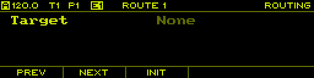
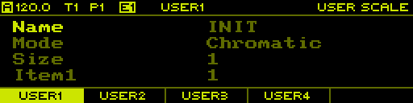

<h1>User Manual</h1>


<!-- TOC -->

<h2 id="toc">Table Of Contents</h2>

<!-- toc-begin -->
- [Table Of Contents](#toc)
- [Introduction](#introduction)
  - [Features](#introduction-features)
- [Concepts](#concepts)
  - [Project](#concepts-project)
  - [Track](#concepts-track)
  - [Note Track](#concepts-note-track)
  - [Curve Track](#concepts-curve-track)
  - [MIDI/CV Track](#concepts-midi-cv-track)
  - [Pattern](#concepts-pattern)
  - [Snapshot](#concepts-snapshot)
  - [Song](#concepts-song)
  - [Scale](#concepts-scale)
  - [Clock](#concepts-clock)
  - [Routing](#concepts-routing)
  - [Controller](#concepts-controller)
  - [File Management](#concepts-file-management)
- [User Interface](#ui)
  - [Overview](#ui-overview)
  - [Navigation](#ui-navigation)
  - [Page Layout](#ui-page-layout)
  - [List Pages](#ui-list-pages)
  - [Copy/Paste](#ui-copy-paste)
- [Pages](#pages)
  - [Project](#pages-project)
  - [Layout](#pages-layout)
  - [Track](#pages-track)
  - [Sequence](#pages-sequence)
  - [Sequence Edit](#pages-sequence-edit)
  - [Song](#pages-song)
  - [Tempo](#pages-tempo)
  - [Pattern](#pages-pattern)
  - [Performer](#pages-performer)
  - [Routing](#pages-routing)
  - [User Scale](#pages-user-scale)
  - [Monitor](#pages-monitor)
  - [Clock](#pages-clock)
- [Appendix](#appendix)
  - [Divisors](#appendix-divisors)
  - [Run Modes](#appendix-run-modes)
  - [Scales](#appendix-scales)
  - [Shapes](#appendix-shapes)
  - [Launchpad](#appendix-launchpad)
<!-- toc-end -->

<!-- Introduction -->

<h2 id="introduction">Introduction</h2>

**per|former** is an open source and open hardware eurorack sequencer module. It packs a lot of functionality into a small form factor and was designed both as a versatile sequencer in the studio as well as for live performance. Due to the amount of functionality in this module, it is highly recommended to study this document carfully to take full advantage of all the features.

The [Concepts](#concepts) chapter introduces the overall architecture and functionality of the sequencer. The [User Interface](#ui) chapter gives an overview of the user interface and introduces key concepts of how to use the sequencer. The [Pages](#pages) chapter goes into more detail in terms of functionality and user interface of the various modes and contexts in the sequencer and introduces common workflows.

<!-- Features -->

<h3 id="introduction-features">Features</h3>

- 8 track sequencer
- 16 patterns per project
- 64 steps per sequence
- Multiple track and sequence modes
- Note and modulation sequencing
- Snapshot system
- Sequence generators
- Advanced clock system
- 8 CV Outputs (-5V to 5V)
- 8 Gate Outputs (5V)
- 4 CV Inputs (-5V to 5V)
- Clock input/output
- MIDI input/output
- USB host port with support for USB MIDI controllers
- 256x64 pixel OLED display
- Encoder with push button
- 32 buttons with bi-color leds
- 5 function buttons with labels on display
- Micro SD card slot

<!-- Concepts -->

<h2 id="concepts">Concepts</h2>

This chapter introduces the basic concepts of the sequencer and should familiarize readers with the overall functionality of the sequencer. More in-depth information about specific features are provided in the following chapters.

<!-- Project -->

<h3 id="concepts-project">Project</h3>

A project stores the complete state of the sequencer, with the exception of calibration data. Only one project can be loaded at any given time and all data is volatile, meaning that all changes are lost when the unit is powered off. To persist a project it needs to be stored to the SD card (see [Project](#pages-project) page).

The following shows a high level diagram of the data contained in a project:

```
┌─────────────────────────────────────────────────────┐
│                       Project                       │
├──────────────────────────┬──────────────────────────┤
│         Settings         │                          │
│          Layout          │                          │
│           Song           │        Tracks 1-8        │
│        Play State        │                          │
│         Routing          │                          │
└──────────────────────────┴──────────────────────────┘
             ┌───────────────────────────┘
             ▼
┌────────────────────────┐   ┌────────────────────────┐
│         Track          │ ┌▶│        Sequence        │
├────────────────────────┤ │ ├────────────────────────┤
│        Settings        │ │ │        Settings        │
├────────────────────────┤ │ ├────────────────────────┤
│     Sequences 1-16     │─┘ │       Steps 1-64       │
└────────────────────────┘   └────────────────────────┘
```

The project is split into two blocks, a global block of data and a block of data for each of the 8 tracks. Each track contains a block of settings and 16 sequences. Each sequence in turn contains a block of settings and its 64 steps.

The 16 sequences of the 8 tracks are collectively handled as patterns.

> Note: Calibration data is stored in the flash memory of the microcontroller and can be backed up and restored from the SD card. This allows for changing the SD card or run the sequencer without an SD card at all and still have it properly calibrated.

<!-- Track -->

<h3 id="concepts-track">Track</h3>

Each of the 8 available tracks is independent of every other track. This means that every sequence of a track can have a different time division, run mode, duration or scale among other things.

<h4>Track Mode</h4>

Each track can be configured to a specific track mode. The following modes are available:

- Note
- Curve
- MIDI/CV

In note mode, the default mode, a track offers advanced step sequencing for programming rhythms and melodies. Curve mode also uses step sequencing, but each step is defined as a curve shape, making this mode very versatile for generating modulation signals. In MIDI/CV mode, a track acts as a MIDI to CV converter, which can be useful when attaching a MIDI keyboard to play some voices live or sequence them from an external MIDI sequencer.

<h4>Track Routing</h4>

In the default configuration, each track controls one of the CV/gate output pairs of the sequencer to control a single voice. However, this configuration can be changed to allow for more flexible routing of the virtual track outputs to the physical CV/gate outputs. For example, a MIDI/CV track can feed more than one physical CV/gate output to allow polyphonic operation or output a velocity signal in addition to the pitch signal.

<h4>Track Linking</h4>

In note or curve mode, a track generates a single CV signal, typically a pitch or modulation signal. To control a voice with multiple signals, for example a pitch and velocity signal, two tracks can be linked together. The first track is used to generate the pitch signal while the second track generates the velocity signal. To make both sequences run in lock-step, the second track can be linked to the first track, essentially doubling the playback behaviour of the first track.

> Note: A track can only be linked to a preceeding track due to the internal architecture of the sequencer. This means that track 1 cannot use track linking, while track 2 can only be linked to track 1. Track 8 on the other hand can be linked to any of the tracks 1-7.

Track modes, the physical routing to CV/gate outputs and track linking can be configured on the [Layout](#pages-layout) page.

<!-- Note Track -->

<h3 id="concepts-note-track">Note Track</h3>

In note mode, the default mode, a track uses step sequencing to output gate and CV signals. A sequence consists of a maximum 64 steps and there is a total of 16 sequences in the track corresponding to the 16 patterns.

TODO

<!-- Curve Track -->

<h3 id="concepts-curve-track">Curve Track</h3>

In curve mode, a track also uses step sequencing with similar playback features to the note track. However, each step is defined as a curve shape.

TODO

<!-- MIDI/CV Track -->

<h3 id="concepts-midi-cv-track">MIDI/CV Track</h3>

In MIDI/CV mode, a track acts as a MIDI to CV converter, taking MIDI note data from either the MIDI or USBMIDI input and feeding it to the CV/gate outputs. This allows for playing voices live from a keyboard or use an external MIDI sequencer to control them. In addition this mode allows the module to act as a very flexible MIDI to CV converter.

<!-- Pattern -->

<h3 id="concepts-pattern">Pattern</h3>

There is a total of 16 patterns per project. Each pattern stores the sequences of all 8 tracks.

TODO

<!-- Snapshot -->

<h3 id="concepts-snapshot">Snapshot</h3>

In addition to the 16 patterns per project, there is an additional snapshot pattern which can temporarily be used to change sequences without affecting the original sequences. Snapshots come in handy during live performance to quickly allow changing sequences and then going back to commiting original state o.pattern. Snapshots are controlled from the [Pattern](#pages-pattern) page.

<!-- Song -->

<h3 id="concepts-song">Song</h3>

Songs are used to chain together a sequence of patterns. This can either be used to quickly chain together a few patterns during a live performance to get more variation or to create an entire arrangement of a song.

A song consists of up to 16 slots, each holding a set of sequences to be played on the 8 tracks in addition to specifying how many times the slot is repeated when played back. Songs are controlled from the [Song](#pages-song) page.

<!-- Scale -->

<h3 id="concepts-scale">Scale</h3>

In contrast to many other sequencers that directly operate on chromatic note values, the **per|former** sequencer is using the concept of voltage tables. Each note is stored as an index into a voltage table that do not necessarily have a specific musical meaning. While offering many of the more commonly used scales in form of presets, the sequencer also provides some scales beyond the typical western chromatic variants, for example a 24 tone equal temperament scale. The additional 4 user scales allow for even more experimentation as well as setting up voltage tables to specifically address discrete values of a CV input on another module. This allows for example to select a specific sample slot, choose a wavetable or similar applications.

A global default scale and root note can be specified on the [Project](#pages-project) page which can be overriden for individual sequences in the [Sequence](#pages-sequence) page. The user scales can be edited on the [User Scale](#pages-user-scale) page. See [Scales](#appendix-scales) appendix for a list of all predefined scales.

<!-- Clock -->

<h3 id="concepts-clock">Clock</h3>

The sequencer is driven by a flexible clock system. In master mode, the clock is generated internally and can be sent to external gear and modules using MIDI clock and analog clock signals. In slave mode, the clock is received from an external source via MIDI or analog clock signals. For convenience, the clock is by default set to an auto mode that automatically switches to master mode when the sequencer is started manually or switches to the slave mode when an external clock signal is detected.

To allow accurate and tight timing, the internal clock resolution is 192 parts per quarter note (PPQN). In master mode, a hardware timer is used to generate an accurate, low-jitter clock signal. To drive external clock signals, the internal clock is divided down to the required PPQN of the external clock signals. In slave mode, the external clock signal is multiplied internally to generate the 192 PPQN internal clock resolution, which in turn is used to clock the sequencer as well as the external clock signals.

TODO

<!-- Routing -->

<h3 id="concepts-routing">Routing</h3>

TODO

<!-- Controller -->

<h3 id="concepts-controller">Controller</h3>

TODO

<!-- File Management -->

<h3 id="concepts-file-management">File Management</h3>

The SD card can be used to store various resources such as projects, user scales and settings. Resources are stored into slots, with each type having a total of 128 slots available. The actual content on the SD card looks as follows:

- `PROJECTS/`
  - `001.PRO`
  - `002.PRO`
  - `...`
- `SCALES/`
  - `001.SCA`
  - `002.SCA`
  - `...`
- `SETTINGS.DAT`

where `001.PRO` is the first project slot, `002.SCA` is the second user scale slot and `SETTINGS.DAT` is the backup of the global settings (also stored in on-chip flash memory).

The reason for using a slot system rather than traditional filenames is in order to allow for a smooth user experience while preserving the limited resources on the system.

> Note: The SD card can easily be backed up to a computer by just copying the files. Slots can freely be rearranged by just renaming the files.

<!-- User Interface -->

<h2 id="ui">User Interface</h2>

<!-- Overview -->

<h3 id="ui-overview">Overview</h3>

The user interface of the **per|former** sequencer is made up from the following components:

- OLED display
- Rotary encoder with button
- 5 function button
- 32 button with bi-color LEDs

The rotary encoder will furthermore be denoted as `ENCODER`. The buttons are split into 4 groups:

<h4>Function Buttons</h4>

There are 5 function buttons below the display: `F1`, `F2`, `F3`, `F4` and `F5`. The function associated with each button depends on the currently selected page and context. However, due to each function button being dynamically labeled on the display, its always easy to see what the associated functions are.

<h4>Global Buttons</h4>

There are 8 global buttons: `PLAY`, `TEMPO`, `PATT`, `PERF`, `PREV`, `NEXT`, `SHIFT` and `PAGE`.

| Button | Behaviour |
| :--- | :--- |
| `PLAY` | Starts/stops the master clock. |
| `SHIFT` + `PLAY` | Pause/continue or restart master clock depending on the configured _Shift Mode_ on the [Clock](#pages-clock) page. |
| `TEMPO` | Temporarily show the [Tempo](#pages-tempo) page. |
| `PAGE` + `TEMPO` | Enter the [Clock](#pages-clock) page. |
| `PATT` | Temporarily show the [Pattern](#pages-pattern) page. |
| `PAGE` + `PATT` | Enter the [Pattern](#pages-pattern) page. |
| `PERF` | Temporarily show the [Performer](#pages-performer) page. |
| `PAGE` + `PERF` | Enter the [Performer](#pages-performer) page. |
| `PREV`, `NEXT` | Depends on current context. |
| `SHIFT` | Enable alternate function, depends on current context. |
| `PAGE` | Switch between pages. |
| `SHIFT` + `PAGE` | Open context menu on the active page. |

<h4>Track Buttons</h4>

There are 8 track buttons: `TRACK1` up to `TRACK8`. These buttons are generally used to selected the active track, but also to select pages in combination with the `PAGE` key and some other functions depending on the active page.

<h4>Step Buttons</h4>

There are 16 step buttons: `STEP1` up to `STEP16`. These buttons are generally used to select steps in a sequence, but also to select pages in combination with the `PAGE` key and some other functions depending on the active page.

<!-- Navigation -->

<h3 id="ui-navigation">Navigation</h3>

The user interface is organized in multiple pages, each page giving access to a different part of the sequencer such as:

- editing configuration options
- editing sequences and steps
- performance related functions such as tempo, muting or pattern selection
- displaying various other information

The active page is selected by holding the `PAGE` button and pressing the corresponding page button:

| Button | Page |
| :--- | :--- |
| `PAGE` + `CLOCK` (`TEMPO`) | [Clock](#pages-clock) |
| `PAGE` + `PATT` | [Pattern](#pages-pattern) |
| `PAGE` + `PERF` | [Performer](#pages-performer) |
| `PAGE` + `PROJECT` (`TRACK1`) | [Project](#pages-project) |
| `PAGE` + `LAYOUT` (`TRACK2`) | [Layout](#pages-layout) |
| `PAGE` + `TRACK` (`TRACK3`) | [Track](#pages-track) |
| `PAGE` + `SEQ` (`TRACK4`) | [Sequence](#pages-sequence) |
| `PAGE` + `SEQ EDIT` (`TRACK5`) | [Sequence Edit](#pages-sequence-edit) |
| `PAGE` + `SONG` (`TRACK7`) | [Song](#pages-song) |
| `PAGE` + `ROUTING` (`TRACK8`) | [Routing](#pages-routing) |
| `PAGE` + `USER SCALE` (`STEP1`) | [User Scale](#pages-user-scale) |
| `PAGE` + `MONITOR` (`STEP7`) | [Monitor](#pages-monitor) |
| `PAGE` + `SETTINGS` (`STEP8`) | [Settings](#pages-settings) |

There are 3 special pages which can be entered temporarily by just holding a single button, namely the [Tempo](#pages-tempo), [Pattern](#pages-pattern) and [Performer](#pages-performer) pages. These pages give access to performance related features which need to be quickly accessible.

> Note: While holding `PAGE`, the leds are used to indicate the currently selected page as well as marking the buttons associated with a page.

<!-- Page Layout -->

<h3 id="ui-page-layout">Page Layout</h3>

Each page is divided into three sections.

<h4>Header</h4>


The _header_ is used to display the global state of the sequencer as well as information about the active page and context.

The current clock mode and tempo are shown in the top-left corner. The clock mode can by any of the following:

- `A` auto
- `M` master
- `S` slave
- `R` recording

The currently selected track is shown as `T1` - `T8`. The currently playing pattern on the selected track is shown as `P1` - `P16`. If a song is currently playing, the playing pattern is highlighted. The currently edited pattern is shown as `E1` - `E16` and is highlighted if it matches the pattern currently playing. If a snapshot is currently active, the pattern info is replaced with a single item `SNAP`.

The currently active page is shown in the top-right corner and optionally a sub-page or mode is shown to its left.

<h4>Body</h4>

The _body_ is used to display the main content for the active page.


<h4>Footer</h4>


The _footer_ is used to display the labels of the function keys for the current page. On pages that provide a context menu, the labels dynamically change to the context menu actions when `SHIFT` + `PAGE` is hold.

<!-- List Pages -->

<h3 id="ui-list-pages">List Pages</h3>

Pages that expose configuration options are typically presented as a list of items, each having the name shown on the left and the value on the right side.

Turn the `ENCODER` or use `<`, `>` to navigate up and down the list. Press `ENCODER` to enter and leave edit mode which is indicated by moving the highlight from the item name to the item value and back. While in edit mode, turn the `ENCODER` or use `<`, `>` to adjust the value. Hold `SHIFT` to change the value in larger or smaller steps depending on the edited item.

<!-- Copy/Paste -->

<h3 id="ui-copy-paste">Copy/Paste</h3>

To allow moving and copying data, a copy/paste system is implemented that allows acting on the following types of objects:

- Track (see [Track](#pages-track) page)
- Sequence (see [Sequence](#pages-sequence) page)
- Steps (see [Sequence Edit](#pages-sequence-edit) page)
- Pattern (see [Pattern](#pages-pattern) page)
- User Scale (see [User Scale](#pages-user-scale) page)

Copy/paste actions are provided in the context menu when holding `SHIFT` + `PAGE`.

> Note: Due to memory limitations, the clipboard can only hold one object at a time and shares memory across all different types. This means that copying an object always results in the previously copied object beeing cleared from the clipboard.

<!-- Pages -->

<h2 id="pages">Pages</h2>

<!-- Project -->

<h3 id="pages-project">Project</h3>

The _Project_ page is entered using `PAGE` + `PROJECT`.


This page allows to change project wide parameters as well loading and saving projects from/to the SD card.

<h4>Parameters</h4>

The following parameters are available:

| Item | Range | Description |
| :--- | :--- | :--- |
| Name | - | Press `ENCODER` to enter text editor. |
| Tempo | 1.0 - 1000.0 BPM | Tempo of the master clock. |
| Swing | 50% - 75% | Global swing amount. |
| Sync Measure | 1 - 128 | Multiple of measures/bars at which to execute _syncing_ (see [Pattern](#pages-pattern) and [Performer](#pages-performer) pages) as well as the duration each pattern slot is played for in song mode (see [Song](#pages-song) page). |
| Scale | [Scales](#appendix-scales) | Default scale. Can be overwritten per sequence on the [Sequence](#pages-sequence) page. |
| Root Note | C, C#, D, D#, E, F, F#, G, G#, A, B | Default root note. Can be overwritten per sequence on the [Sequence](#pages-sequence) page. |

> Note: _Tempo_ and _Swing_ are routable parameters.

<h4>Actions</h4>

Use `SHIFT` + `PAGE` to open the context menu for accessing the following actions:

| Button | Action | Description |
| :--- | :--- | :--- |
| `F1` | Init | Initialize the project to its default state. This will revert all unsaved changes. |
| `F2` | Load | Load a project from the SD card. |
| `F3` | Save | Save the project to the SD card and automatically overwrite the previous slot. |
| `F4` | Save As | Save the project to a new slot on the SD card. |
| `F5` | Route | Create a new route for the currently selected parameter (only active if selected parameter is routable). |

> Note: Should you ever get bored sequencing, take a break and hit `PAGE` + `STEP16`.

<!-- Layout -->

<h3 id="pages-layout">Layout</h3>

The _Layout_ page is entered using `PAGE` + `LAYOUT`. This page has 4 tabs accessed through `F1`, `F2`, `F3` and `F4`.

<h4>Track Mode</h4>

The first tab is used to configure the track mode of each track.


Changing the track mode results in all data of the given track being deleted. Because of this, when setting a new track mode, it only takes effect after commiting it using `F5`.


<h4>Link Track</h4>

The second tab is used to setup track linking. Each of the 8 tracks can be linked to any of the preceeding tracks, taking over its playback behaviour.


<h4>Gate Output</h4>

The third tab is used to setup the mapping of virtual track gate outputs to the physical gate outputs. In default state, each track is linked to the corresponding gate output with the same number.


<h4>CV Output</h4>

The fourth tab is used to setup the mapping of virtual track CV outputs to the physical CV outputs. In default state, each track is linked to the corresponding CV output with the same number.


If using a MIDI/CV track, it can be useful to map multiple virtual outputs of the track to physical outputs to allow for polyphonic signals or add modulation signals such as velocity or aftertouch. The following shows a configuration with two note polyphony and pitch/velocity signals.


<!-- Track -->

<h3 id="pages-track">Track</h3>

The _Track_ page is entered using `PAGE` + `TRACK`.


This page allows to change track wide settings. Note that the parameters depend on the configured _Track Mode_ of the selected track.

Use `SHIFT` + `PAGE` to open the context menu for accessing the following actions:

| Button | Action | Description |
| :--- | :--- | :--- |
| `F1` | Init | Initialize the track and all its content to the default state. |
| `F2` | Copy | Copy the selected track and all its content to the clipboard. |
| `F3` | Paste | Paste the clipboard to the selected track. |
| `F4` | Route | Create a new route for the currently selected parameter (only active if selected parameter is routable). |

<h4>Note Track</h4>

TODO image

The following parameters are available:

| Item | Range | Description |
| :--- | :--- | :--- |
| Play Mode | Free, Aligned |  |
| Fill Mode | Gates, Next Pattern |  |
| Slide Time | 0% - 100% |  |
| Octave | -10 - +10 |  |
| Transpose | -100 - +100 |
| Rotate | -64 - +64 |  |
| Step P. Bias | -100% - +100% | |
| Step L. Bias | -100% - +100% | |

> Note: _Slide Time_, _Octave_, _Transpose_, _Rotate_, _Step P. Bias_ and _Step L. Bias_ are routable parameters.

<h4>Curve Track</h4>

TODO image

The following parameters are available:

| Item | Range | Description |
| :--- | :--- | :--- |
| Play Mode | Free, Aligned |  |
| Fill Mode | Gates, Next Pattern |  |
| Rotate | -64 - +64 |  |

<h4>MIDI/CV Track</h4>

TODO image

The following parameters are available:

| Item | Range | Description |
| :--- | :--- | :--- |
| MIDI Port | Free, Aligned |  |
| MIDI Channel | Gates, Next Pattern |  |
| Voices | -64 - +64 |  |
| Voice Config | -64 - +64 |  |
| Pitch Bend | -64 - +64 |  |
| Mod Range | -64 - +64 |  |
| Retrigger | -64 - +64 |  |

<!-- Sequence -->

<h3 id="pages-sequence">Sequence</h3>

The _Sequence_ page is entered using `PAGE` + `SEQ`.


<h4>Note Track</h4>

The following parameters are available:

| Item | Range | Description |
| :--- | :--- | :--- |
| Scale | [Scales](#appendix-scales) | Scale to use for this sequence. If set to _Default_, uses the default scale set on the [Project](#pages-project) page. |
| Root Note | C, C#, D, D#, E, F, F#, G, G#, A, B | Root note to use for this sequence. If set to _Default_, uses the default root note set on the [Project](#pages-project) page. |
| Divisor | [Divisors](#appendix-divisors) | The time divisor for this sequence. |
| Reset Measure | off, 1 - 128 | Number of measures/bars at which to reset the sequence. |
| Run Mode | [Run Modes](#appendix-run-modes) | The run mode in which to play.  |
| First Step | 1 - 64 | The first step to play. |
| Last Step | 1 - 64 | The last step to play. |

<h4>Curve Track</h4>


<!-- Sequence Edit -->

<h3 id="pages-sequence-edit">Sequence Edit</h3>

The _Sequence Edit_ page is entered using `PAGE` + `SEQ EDIT`.

TODO


<!-- Song -->

<h3 id="pages-song">Song</h3>

The _Song_ page is entered using `PAGE` + `SONG`.


A song consists of up to 16 slots, each referencing a set of 8 patterns to be played on the 8 tracks. Each slot is played for the duration set by _Sync Measure_ on the [Project](#pages-project) page and can be repeated up to 8 times.

<h4>Pattern Chaining</h4>

A quick way to create songs on the fly is pattern chaining. This mode is specifically made for live performance to quickly create more interesting structures by chaining multiple patterns together.

To create a pattern chain, hold `F2` and press `STEP[1-16]` to select the pattern to be played for the newly created slot. If the same pattern is added multiple times by pressing `STEP[1-16]` again, the repeat count of the last added slot is incremented. For example, holding `F2` and pressing the sequence `STEP1`, `STEP1`, `STEP1`, `STEP2`, `STEP1`, `STEP1`, `STEP1`, `STEP3` will create the following slot list:


Note that when creating pattern chains, the song mode is automatically started.

<h4>Editing</h4>

- Rotate the `ENCODER` or use `<` and `>` to select any of the assigned slots indicated with the small cursor above the slots.
- Press `F1` to clear the slot list.
- Press `F3` to add a slot at the end of the list.
- Press `SHIFT` + `F3` to insert a slot at the current cursor position.
- Press `F4` to remove the selected slot.
- Hold `SHIFT` and rotate the `ENCODER` or use `<` and `>` to move the selected slot forward and backward in the slot list.
- Press `STEP[1-16]` to assign a pattern to all tracks of the selected slot.
- Hold any combination of `TRACK[1-8]` and press `STEP[1-16]` to assign a pattern to a group of tracks of the selected slot.
- Press and rotate the `ENCODER` to adjust the number of repeats on the selected slot.

<h4>Playback</h4>

Song playback can be started and stopped independently of the sequencer actually running. This allows to engange song playback while the sequencer is already running, or stop song playback without stopping the sequencer. Song playback simply changes the playing patterns automatically and in sync.

Press `F5` to start playback of the song from the currently selected slot. This will also start the sequencer if it is not already running. Playback will be immediate, meaning that the currently playing pattern is switched instantaneousy. To start playback on the next _Sync Measure_, use `SHIFT` + `F5` to start playback. A progress bar will appear at the top of the page, indicating the time until playback is started. To stop playback, simply press `F5` again.

During playback, the current slot being played is indicated by a small cursor below the slot list with a small progress bar indicating the progress through the slot. In addition, the currently playing pattern in the header list is highlighted.

> Note: Song mode can also be used to toggle between different sets of patterns. Simply use slots to define the pattern sets and then select a slot and press `F5` twice to quickly start/stop song playback to switch to a new set of patterns.

<!-- Tempo -->

<h3 id="pages-tempo">Tempo</h3>

The _Tempo_ page is temporarily shown while holding `TEMPO`.


On this page the tempo of the master clock is adjusted. Simply rotate the `ENCODER` to adjust the tempo. Press and rotate the `ENCODER` to adjust the tempo in smaller steps. Hold `SHIFT` and rotate the `ENCODER` to adjust in larger steps.

<h4>Tap Tempo</h4>

In addition to manually adjusting the tempo, it can also be set using tap tempo by pressing `PLAY` in a regular interval while holding `TEMPO`.

<h4>Nudging</h4>

To sync the master clock by ear to some other source, for example a turntable, tempo nudging is a useful feature. This allows the tempo to be temporarily increased/decreased within a 10% range. Nudging is activated by holding `TEMPO` and holding `NEXT` or `PREV` to increase/decrease the tempo. The amount of tempo change due to nudging is visualized on the tempo page.


> Note: The tempo is incrementally increased/decreased up to 10%, so one needs to hold both `TEMPO` and `NEXT` or `PREV` for a small amount of time to get an effect.

<!-- Pattern -->

<h3 id="pages-pattern">Pattern</h3>

**TODO:** insert image

The _Pattern_ page can either be permanently entered using `PAGE` + `PATT` or just temporarily while holding `PATT`.

On this page you can handle pattern changes as well as selecting the currently edited pattern.

<!-- Performer -->

<h3 id="pages-performer">Performer</h3>

**TODO:** insert image

The _Performer_ page can either be permanently entered using `PAGE` + `PERF` or just temporarily while holding `PERF`.

On this page you can handle mutes/solos as well as fills. Similar as with pattern changes you can also schedule mute, unmute or solo actions either by using _latching_ or _syncing_.

The temporary mode is very handy to quickly trigger performance actions while working on another page.

<h4>Mutes/Solos</h4>

Press `TRACK[1-8]` to mute and unmute tracks or `STEP[1-8]` to solo a track. Press `F3` to unmute all tracks at once.

<h4>Latching Mutes/Solos</h4>

To perform multiple actions at the same time, hold `F1` while executing mute, unmute or solo actions. All actions are scheduled and executed at the same time when `F1` is let go. While `F1` is hold and some actions have been scheduled, you can press `F5` to cancel them.

<h4>Synced Mutes/Solos</h4>

To execute actions on a musical beat, hold `F2` while executing mute, unmute or solo actions. A progress bar will appear at the top of the page, indicating the time until the actions are executed. Again, while holding `F2` you can press `F5` to cancel any scheduled action.

> Note: Synced actions are triggered on the beginning of a musical measure, configured on the [Project](#pages-project) page using the _Sync Measure_ parameter.

<h4>Fills</h4>

Hold `STEP[9-16]` to enable fills on individual tracks. Hold `F4` to fill all tracks at once.

> Note: There are different fill modes that can be configured per track on the [Track](#pages-track) page using the _Fill Mode_ parameter.

<h3 id="pages-routing">Routing</h3>

<!-- Routing -->

The _Routing_ page is entered using `PAGE` + `ROUTING`.



| Parameter  | Range | Description |
| :--- | :--- | :--- |
| Parameter | Routable Parameters | Target parameter to affect by this route. |
| Min | - | Minimum value, depending on the selected parameter. |
| Max | - | Maximum value, depending on the selected parameter. |
| Tracks | - | Target tracks to affect by this route. Only available if selected parameter is a track parameter. |
| Source | None, CV In 1 - 4, CV Out 1 - 8, MIDI | Source signal to use. _CV In 1 - 4_ correspond to the physical CV inputs. _CV Out 1 - 8_ correspond to the CV output signals generated by the sequencer. _MIDI_ uses events either from MIDI or USB MIDI. |
| Range | 1V - 5V Unipolar, 1V - 5V Bipolar | The voltage range to use for the CV source. Only available if source is set to a CV signal. |
| MIDI Port | MIDI, USB | The MIDI port used for the source. Only available when source is set to _MIDI_. |
| MIDI Channel | Omni, 1 - 16 | The MIDI channel used for the source. Only available when source is set to _MIDI_. |
| MIDI Event | CC Absolute, CC Relative, Pitch Bend, Note Momentary, Note Toggle, Note Velocity | The type of MIDI event to use as the source signal. |
| CC Number | 0 - 127 | The MIDI CC number to use as the source signal. Only available if MIDI Event is set to _CC Aboslute_ or _CC Relative_. |
| Note | C-1 - G9 | The MIDI note value to use as the source signal. Only available if MIDI Event is set to _Note Momentary_, _Note Toggle_ or _Note Velocity_. |

<!-- User Scale -->

<h3 id="pages-user-scale">User Scale</h3>

The _User Scale_ page is entered using `PAGE` + `USER SCALE`. Here you can edit the 4 user scales stored in the project.

TODO



<!-- Monitor -->

<h3 id="pages-monitor">Monitor</h3>

The _Monitor_ page is entered using `PAGE` + `MONITOR`. This page has 4 tabs accessed using `F1`, `F2`, `F3` and `F4`.

<h4>CV Inputs</h4>

The first tab shows the current voltages of the CV inputs.


<h4>CV Ouputs</h4>

The second tab shows the current voltages of the CV outputs.


<h4>MIDI</h4>

The third tab shows incoming MIDI messages.


<h4>Stats</h4>

The fourth tab shows general stats of the sequencer such as the total uptime and overflows of the MIDI message queues.


<!-- Clock -->

<h3 id="pages-clock">Clock</h3>

The _Clock_ page is entered using `PAGE` + `CLOCK`.


This page is used to setup the clock system of the sequencer using the following parameters:

| Parameter  | Range | Description |
| :--- | :--- | :--- |
| Mode | Auto, Master, Slave | Clock mode |
| Shift Mode | Restart, Pause | The action to perform when `SHIFT` + `PLAY` is pressed: In _Restart_ mode, the master clock is restarted. In _Pause_ mode, the master clock is stopped/resumed. |
| Input Divisor | [Divisors](#appendix-divisors) | The musical note at which to interpret incoming clock pulses. The divisor is actually used as a clock multiplier to generate the internal 192 PPQN clock resolution. |
| Input Mode | Reset, Run, Start/Stop | The mode in which to handle the incoming clock control signal. In _Reset_ mode, the clock is kept in reset state while a high signal is read. In _Run_ mode, the clock is only run when the signal is high. In _Start/Stop_ mode, the clock is started when a high signal is read and stopped/paused when a low signal is read. |
| Output Divisor | [Divisors](#appendix-divisors) | The musical note at which to generate outgoing clock pulses. The divisor is used to divide the internal 192 PPQN clock resolution to generate the outgoing clock pulses. |
| Output Pulse | 1 - 5 ms | Duration of the outgoing clock pulses. |
| Output Mode | Reset, Run | The mode for generating the outgoing clock control signal. In _Reset_ mode, the signal is high when the clock is stopped and in reset state. In _Run_ mode, the signal is high when the clock is currently running. |
| MIDI RX | yes, no | Enable/disable receiving MIDI clock from MIDI. |
| MIDI TX | yes, no | Enable/disable sending MIDI clock to MIDI. |
| USBMIDI RX | yes, no | Enable/disable receiving MIDI clock from USB MIDI. |
| USBMIDI TX | yes, no | Enable/disable sending MIDI clock to USB MIDI. |

<!-- Settings -->

<h3 id="pages-settings">Settings</h2>

TODO

<!-- Appendix -->

<h2 id="appendix">Appendix</h2>

<!-- Divisors -->

<h3 id="appendix-divisors">Divisors</h3>

Divisors are used to divide the clock ticks with a resolution of 192 PPQN into periods corresponding to musical notes. While any integer number between 1 and 192 can be used as a divisor, the following known divisor values are used to generate the commonly used musical notes:

| Divisor | Note | Name |
| :--- | :--- | :--- |
| 2   | 1/64T | Triplet sixty-fourth note   |
| 3   | 1/64  | Sixty-fourth note           |
| 4   | 1/32T | Triplet thirty-second note  |
| 6   | 1/32  | Thirty-second note          |
| 8   | 1/16T | Triplet sixteenth note      |
| 9   | 1/32. | Dotted thirty-second note   |
| 12  | 1/16  | Sixteenth note              |
| 16  | 1/8T  | Triplet eighth note         |
| 18  | 1/16. | Dotted sixteenth note       |
| 24  | 1/8   | Eighth note                 |
| 32  | 1/4T  | Triplet quarter note        |
| 36  | 1/8.  | Dotted eighth note          |
| 48  | 1/4   | Quarter note                |
| 64  | 1/2T  | Triplet half note           |
| 72  | 1/4.  | Dotted quarter note         |
| 96  | 1/2   | Half note                   |
| 128 | 1T    | Triplet whole note          |
| 144 | 1/2.  | Dotted half note            |
| 192 | 1     | Whole note                  |

<!-- Run Modes -->

<h3 id="appendix-run-modes">Run Modes</h3>

Step sequences can be run in various run modes, which describe the order in which the steps of the sequence are played. To illustrate the different run modes, assume a sequence with `N = 8` steps, indexed from `1` to `8`:

`1 2 3 4 5 6 7 8`

<h4>Forward</h4>

In forward mode, the sequence is played from the first to the last step and then repeated. Each iteration is exactly `N` steps:

`1 2 3 4 5 6 7 8 | 1 2 3 4 5 6 7 8 | 1 ...`

<h4>Backward</h4>

In backward mode, the sequence is played from the last to the first step and the repeated. Each iteration is exactly `N` steps:

`8 7 6 5 4 3 2 1 | 8 7 6 5 4 3 2 1 | 8 ...`

<h4>Pendulum</h4>

In pendulum mode, the sequence is alternatly played in forward and backward mode. Each iteration is exactly `2 * N` steps:

`1 2 3 4 5 6 7 8 8 7 6 5 4 3 2 1 | 1 ...`

<h4>Ping Pong</h4>

In ping pong mode, the sequence is played similarly to the pendulum mode, but when changing direction, the first/last step is not played twice. This essentially shortens the iteration by two steps to `2 * N - 2` steps:

`1 2 3 4 5 6 7 8 7 6 5 4 3 2 | 1 ...`

<h4>Random</h4>

In random mode, the sequence starts with a random step and each time the sequence advances, a new random step is picked:

`4 7 5 3 5 7 5 3 5 6 8 6 4 2 4 1 3 6 ...`

<h4>Random Walk</h4>

In random walk mode, the sequence starts with a random step and each time the sequence advances, a random coin toss is used to either pick the step to the left or to the right of the last played step. This also works across the boundary from the first to the last step of the sequence:

`7 8 7 8 1 2 1 2 3 2 3 4 5 4 3 4 3 2 ...`

<!-- Scales -->

<h3 id="appendix-scales">Scales</h3>

<h4>Chromatic</h4>

| Index | 1 | 2 | 3 | 4 | 5 | 6 | 7 | 8 | 9 | 10 | 11 | 12 |
| :--- | --- | --- | --- | --- | --- | --- | --- | --- | --- | --- | --- | --- |
| Name | 1 | 1# | 2 | 2# | 3 | 4 | 4# | 5 | 5# | 6 | 6# | 7 |
| Volts | 0.000 | 0.083 | 0.167 | 0.250 | 0.333 | 0.417 | 0.500 | 0.583 | 0.667 | 0.750 | 0.833 | 0.917 |

<h4>Major</h4>

| Index | 1 | 2 | 3 | 4 | 5 | 6 | 7 |
| :--- | --- | --- | --- | --- | --- | --- | --- |
| Name | 1 | 2 | 3 | 4 | 5 | 6 | 7 |
| Volts | 0.000 | 0.167 | 0.333 | 0.417 | 0.583 | 0.750 | 0.917 |

<h4>Minor</h4>

| Index | 1 | 2 | 3 | 4 | 5 | 6 | 7 |
| :--- | --- | --- | --- | --- | --- | --- | --- |
| Name | 1 | 2 | 3b | 4 | 5 | 6 | 7 |
| Volts | 0.000 | 0.167 | 0.250 | 0.417 | 0.583 | 0.750 | 0.917 |

<h4>Algerian</h4>

| Index | 1 | 2 | 3 | 4 | 5 | 6 | 7 |
| :--- | --- | --- | --- | --- | --- | --- | --- |
| Name | 1 | 2 | 3b | 4# | 5 | 6b | 7 |
| Volts | 0.000 | 0.167 | 0.250 | 0.500 | 0.583 | 0.667 | 0.917 |

<h4>Major Pent.</h4>

| Index | 1 | 2 | 3 | 4 | 5 |
| :--- | --- | --- | --- | --- | --- |
| Name | 1 | 2 | 3 | 5 | 6 |
| Volts | 0.000 | 0.167 | 0.333 | 0.583 | 0.750 |

<h4>Minor Pent.</h4>

| Index | 1 | 2 | 3 | 4 | 5 |
| :--- | --- | --- | --- | --- | --- |
| Name | 1 | 3b | 4 | 5 | 7b |
| Volts | 0.000 | 0.250 | 0.417 | 0.583 | 0.833 |

<h4>Whole Tone</h4>

| Index | 1 | 2 | 3 | 4 | 5 | 6 |
| :--- | --- | --- | --- | --- | --- | --- |
| Name | 1 | 2 | 3 | 4# | 5# | 6# |
| Volts | 0.000 | 0.167 | 0.333 | 0.500 | 0.667 | 0.833 |

<h4>Augumented</h4>

| Index | 1 | 2 | 3 | 4 | 5 | 6 |
| :--- | --- | --- | --- | --- | --- | --- |
| Name | 1 | 3b | 3 | 5 | 5# | 7 |
| Volts | 0.000 | 0.250 | 0.333 | 0.583 | 0.667 | 0.917 |

<h4>Prometheus</h4>

| Index | 1 | 2 | 3 | 4 | 5 | 6 |
| :--- | --- | --- | --- | --- | --- | --- |
| Name | 1 | 2 | 3 | 4# | 6 | 7b |
| Volts | 0.000 | 0.167 | 0.333 | 0.500 | 0.750 | 0.833 |

<h4>Blues</h4>

| Index | 1 | 2 | 3 | 4 | 5 | 6 |
| :--- | --- | --- | --- | --- | --- | --- |
| Name | 1 | 3b | 4 | 5b | 5 | 7b |
| Volts | 0.000 | 0.250 | 0.417 | 0.500 | 0.583 | 0.833 |

<h4>Tritone</h4>

| Index | 1 | 2 | 3 | 4 | 5 | 6 |
| :--- | --- | --- | --- | --- | --- | --- |
| Name | 1 | 2b | 3 | 5b | 5 | 7b |
| Volts | 0.000 | 0.083 | 0.333 | 0.500 | 0.583 | 0.833 |

<h4>5-tet</h4>

| Index | 1 | 2 | 3 | 4 | 5 |
| :--- | --- | --- | --- | --- | --- |
| Name | 0.0 | 0.2 | 0.4 | 0.6 | 0.8 |
| Volts | 0.000 | 0.200 | 0.400 | 0.600 | 0.800 |

<h4>7-tet</h4>

| Index | 1 | 2 | 3 | 4 | 5 | 6 |
| :--- | --- | --- | --- | --- | --- | --- |
| Name | 0.0 | 0.1 | 0.3 | 0.4 | 0.6 | 0.7 |
| Volts | 0.000 | 0.143 | 0.286 | 0.429 | 0.571 | 0.714 |

<h4>12-tet</h4>

| Index | 1 | 2 | 3 | 4 | 5 | 6 | 7 | 8 | 9 | 10 | 11 | 12 |
| :--- | --- | --- | --- | --- | --- | --- | --- | --- | --- | --- | --- | --- |
| Name | 0.0 | 0.1 | 0.2 | 0.3 | 0.3 | 0.4 | 0.5 | 0.6 | 0.7 | 0.8 | 0.8 | 0.9 |
| Volts | 0.000 | 0.083 | 0.167 | 0.250 | 0.333 | 0.417 | 0.500 | 0.583 | 0.667 | 0.750 | 0.833 | 0.917 |

<h4>24-tet</h4>

| Index | 1 | 2 | 3 | 4 | 5 | 6 | 7 | 8 | 9 | 10 | 11 | 12 | 13 | 14 | 15 | 16 | 17 | 18 | 19 | 20 | 21 | 22 | 23 | 24 |
| :--- | --- | --- | --- | --- | --- | --- | --- | --- | --- | --- | --- | --- | --- | --- | --- | --- | --- | --- | --- | --- | --- | --- | --- | --- |
| Name | 0.0 | 0.0 | 0.1 | 0.1 | 0.2 | 0.2 | 0.3 | 0.3 | 0.3 | 0.4 | 0.4 | 0.5 | 0.5 | 0.5 | 0.6 | 0.6 | 0.7 | 0.7 | 0.8 | 0.8 | 0.8 | 0.9 | 0.9 | 1.0 |
| Volts | 0.000 | 0.042 | 0.083 | 0.125 | 0.167 | 0.208 | 0.250 | 0.292 | 0.333 | 0.375 | 0.417 | 0.458 | 0.500 | 0.542 | 0.583 | 0.625 | 0.667 | 0.708 | 0.750 | 0.792 | 0.833 | 0.875 | 0.917 | 0.958 |

<h4>1V</h4>

| Index | 1 | 2 | 3 | 4 | 5 | 6 | 7 | 8 | 9 | 10 |
| :--- | --- | --- | --- | --- | --- | --- | --- | --- | --- | --- |
| Name | 0.0 | 0.1 | 0.2 | 0.3 | 0.4 | 0.5 | 0.6 | 0.7 | 0.8 | 0.9 |
| Volts | 0.000 | 0.100 | 0.200 | 0.300 | 0.400 | 0.500 | 0.600 | 0.700 | 0.800 | 0.900 |

<!-- Shapes -->

<h3 id="appendix-shapes">Shapes</h3>

| Index | 1 | 2 | 3 | 4 | 5 | 6 | 7 | 8 | 9 | 10 | 11 | 12 | 13 | 14 | 15 | 16 | 17 |
| :--- | --- | --- | --- | --- | --- | --- | --- | --- | --- | --- | --- | --- | --- | --- | --- | --- | --- |
| Shapes |  |  |  |  |  |  |  |  |  |  |  |  |  |  |  |  |  |
<!-- Launchpad -->

<h3 id="appendix-launchpad">Launchpad</h3>

TODO
